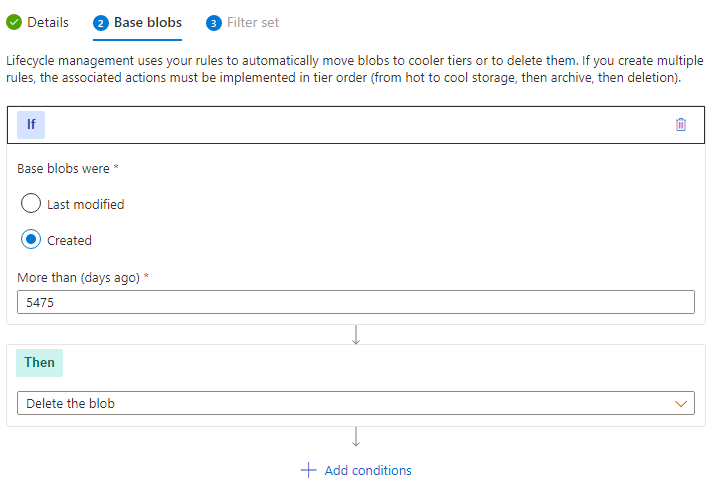

# Task 1.1: Configure data storage for up to 15 years

In this task you'll configure data storage for up to 15 years to comply with legal requirements, improve business continuity in the event of disasters or outages, and provide a source for long-term data analysis and insight services.

The following document may help you complete this task.  

- [Configure a lifecycle management policy](https://learn.microsoft.com/en-us/azure/storage/blobs/lifecycle-management-policy-configure?tabs=azure-portal#create-or-manage-a-policy)

--- 

1. Sign in to @lab.VirtualMachine(Windows 11).SelectLink using these credentials:

    | | |
    |:--|:--|
    | Username | **Your Windows user**  |
    | Password | **Your Windows password** |
    
1. Open Microsoft Edge, go to the [Azure portal](https://portal.azure.com), then sign in using these credentials:
   
    | | |
    |:--|:--|
    | Username | **Your Azure user** |
    | Password | **Your Azure password** |

    {: .warning }
    > If you encounter the **Welcome to Microsoft Azure** screen select **Get started** and then select **Skip** the next two screens.

1. In the Azure search box, search for and select **Storage Accounts**.

1. In the list of storage accounts, select the account named **genstor\***.

1. On the **Storage account** pane, in the left navigation, under **Data management**, select **Lifecycle management**, and then select **+ Add a rule**.

    

1. On the Add a rule page, complete the fields using the following table and then select **Next**:

    | Field | Value |
    |:-----|:-----|
    | Rule name | **15year** |
    | Rule scope | **Limit blobs with filters** |
    | Blob type | **Block blobs** |
    | Blob subtype | **Base blobs** |

    

1. On the **Base blobs** tab, complete the fields using the following table and then select **Next**:

    | Field | Value |
    |:-----|:-----|
    | Base blobs were | **Created** |
    | More than (days ago) | **5475** |
    | Then | **Delete the blob** |

    {: .note }
    > Azure retention rules are always calculated in number of days.  In this situation **15 years** equals **5475 days**.

    

1. On the **Filter set** tab, accept the defaults, and then select **Add**.
