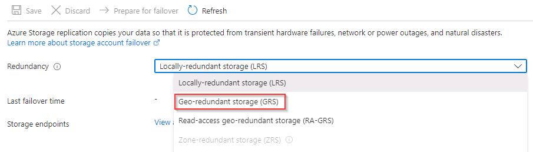

# Task 1.2: Configure storage account as geo-redundant storage

In this task you'll ensure that the primary storage account is configured as geo-redundant storage to ensure high availability, disaster recovery, and regulatory compliance.

The following document may help you complete this task.

- [Change how a storage account is replicated](https://learn.microsoft.com/en-us/azure/storage/common/redundancy-migration?tabs=portal)  

---

1. On the **Storage account** pane, in the left navigation, under **Data management**, select **Redundancy**.

1. On the Redundancy page, change the Redundancy field from **Locally-redundant storage (LRS)** to **Geo-redundant storage (GRS)**, then select **Save**.

    

    {: .note }
    > The failover scenario from primary to secondary regions will be displayed once the synchronization has completed. This can take a few minutes.  You can continue with the next task while this process executes in the background.
