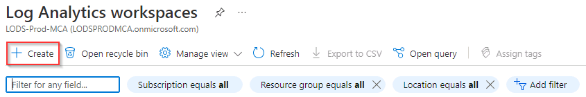

# Task 1.3: Configure Microsoft Sentinel to export data into the Storage account

In this task you'll set up Microsoft Sentinel to export data into the storage account for long-term retention, improved security, and to allow integration with other Azure services improving data analytics and workflows.

The following document may help you complete this task.

- [Log Analytics workspace data export in Azure Monitor](https://learn.microsoft.com/en-us/azure/azure-monitor/logs/logs-data-export?tabs=portal)  

---

1. In the Azure search box, enter **Log Analytics workspaces**, and then select **Log Analytics workspaces** from the results.

1. On the Log Analytics workspace page, select **+ Create**.

    

1. On the Create Log Analytics workspaces page, complete the fields using the following table, then select **Review + Create**:

    | Field | Value |
    |:-----|:-----|
    | Subscription | Default: **@lab.CloudSubscription.Name** |
    | Resource Group | **@lab.CloudResourceGroup(RG1).Name** |
    | Name | **loganalytics-workspace** |
    | Region | **@lab.CloudResourceGroup(RG1).Location** |

1. Once the validation has passed, select **Create**.

1. Once the deployment has completed and you get a notification, select **Go to resource**.

    

1. In the loganalytics-workspace page, on the **loganalytics-workspace** menu, under **Settings** select **Data export**.

1. On the Data export page, select **+ New export rule**.

1. On the Create export rule page, on the **Basics** tab, enter the rule name **exporttostorage**, then select **Next**.

1. On the **Source** tab, select the **Table name** checkbox to select all the entries in the list.

    {: .note }
    > This list represents the data points you'd like to export.

    

1. Select **Next**.

1. On the **Destination** tab, complete the fields using the table below and then select **Next**:

    | Field | Value |
    |:-----|:-----|
    | Destination type | **Storage account** |
    | Subscription | **@lab.CloudSubscription.Name** |
    | Storage account | **genstor\*** |

    

1. Select **Create** to create the export rule.
