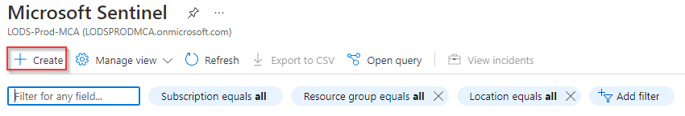
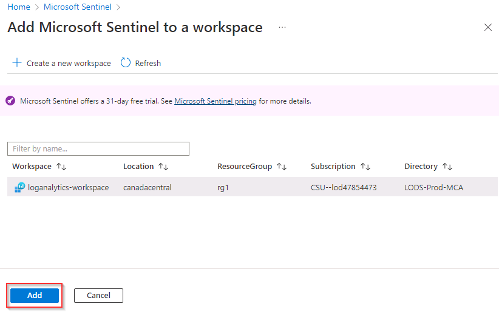

# Task 2.1: Create a Microsoft Sentinel instance in Azure

In this task you'll enable Microsoft Sentinel to set up data connectors to monitor and protect your environment.

The following documents may help you complete this task.

- [Quickstart: Onboard Microsoft Sentinel](https://learn.microsoft.com/azure/sentinel/quickstart-onboard)  
- [Create a Log Analytics workspace](https://learn.microsoft.com/azure/azure-monitor/logs/quick-create-workspace?tabs=azure-portal)

---

1. In the Azure search box, enter **Microsoft Sentinel**, and then select **Microsoft Sentinel** from the results.

1. On the menu, select **+ Create** to add Sentinel to the loganalytics-workspace that you created previously.

    

1. On the Add Microsoft Sentinel to a workspace page, under **Workspace**, select **loganalytics-workspace**, and then select **Add**.

    

     {: .warning } 
     > If the addition of Microsoft Sentinel to the workspace fails retry the addition of the workspace.

1. Once Microsoft Sentinel has successfully been added to the **loganalytics-workspace** workspace select **OK** to close the **Microsoft Sentinel free trial activated** message.
