# Task 2.2: Set up a data connector for Linux

Now that we set up Microsoft Sentinel we can configure our Data Collectors. For this task, we’ll be connecting Syslog. 

Syslog is an event logging protocol that's common to Linux. You can use the Syslog daemon built into Linux devices and appliances to collect local events of the types you specify, and have it send those events to Microsoft Sentinel using the Log Analytics agent for Linux.

The following documents may help you complete this task.

- [Microsoft Sentinel data connectors](https://learn.microsoft.com/azure/sentinel/connect-data-sources)  
- [Connect SysLog - Configure your Linux machine or appliance](https://learn.microsoft.com/en-us/azure/sentinel/connect-syslog#configure-your-linux-machine-or-appliance)

---

1. On the Microsoft Sentinel page, under **Configuration**, select **Data connectors**.

1. On the Connectors summary bar select **More content at Content hub**

    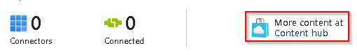{250}

1. On the Content hub page select the **Provider** filter and clear the **All** checkbox.  

1. In the **Provider** search box, enter +++Microsoft+++ , select **Microsoft** from the results, and then select **Apply**.

    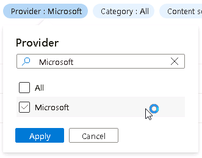{200}

1. On the Content hub page in the search box, enter +++Syslog+++, and then select **Syslog** from the results.

1. On the **Syslog details** panel, review the description, and then select **Install**.

    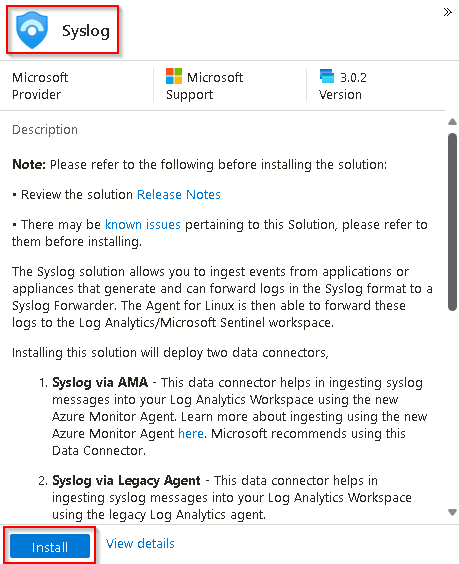{250}

1. When the installation of the Syslog connector has completed, return to the Data connectors page by selecting **Microsoft Sentinel | Data connectors** on the breadcrumb at the top of the page.

    

1. On the Microsoft Sentinel | Data connectors page, in the **Search by name or provider** box, enter +++Syslog+++. 

    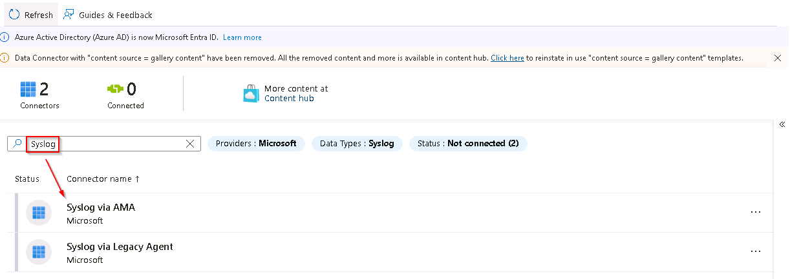

     {: .warning } 
     > If the **Syslog via AMA** data connector does not appear in the list, select **Refresh** from the menu.

1. Select the **Syslog via AMA** connector from the list to configure the Linux system log connector. 

1. On the **Syslog via AMA** pane, select **Open connector page**.

    <!-- WK-Mar 11/24 End: Adding retrieving Syslog connector from Content hub -->

    <!-- WK-Apr 4/24 Start: Adding Syslog Via AMA configuration steps -->

1. On the Syslog via AMA page, under **Configuration**, select **+Create data collection rule**.

    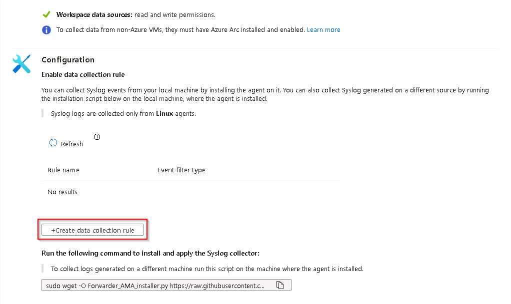

1. On the **Basic** tab of the Create Data Collection Rule page, complete the fields using the table below and then select **Next: Resources >**:

    | Field | Value |
    |:-----|:-----|
    | Rule name | +++linuxdata+++ |
    | Subscription | **@lab.CloudSubscription.Name** |
    | Resource group | **@lab.CloudResourceGroup(RG1).Name** |

1. On the **Resources** tab of the Create Data Collection Rule page, expand the **@lab.CloudSubscription.Name** scope and then expand the **@lab.CloudResourceGroup(RG1).Name**.

1. Select the **Linux1** Virtual Machine checkbox, and then select **Next: Collect >**:

    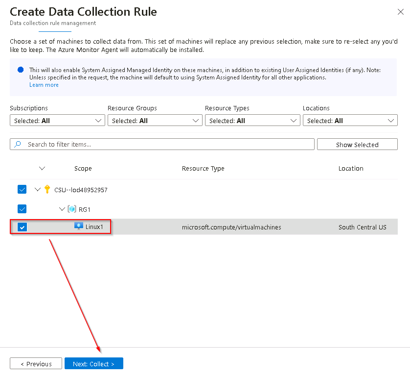

1. On the **Collect** tab of the Create Data Collection Rule page, scroll down to the **LOG_SYSLOG** facility and set the **Minimum log level** to **LOG_NOTICE** and then select **Next: Review + create >**.

    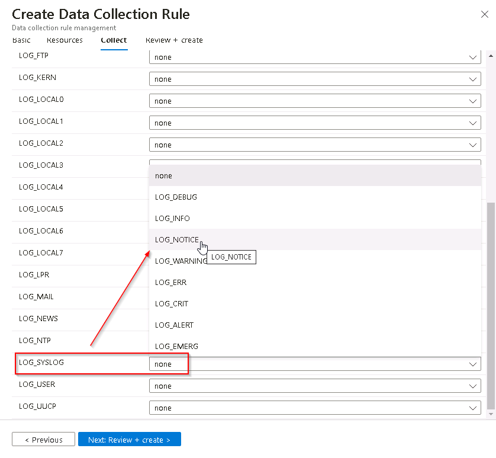

1. Once the validation has passed select **Create**.

    >[!note]If the Syslog data connector process is slow to fully complete you can monitor for completion by opening the notifications panel.  To do this select the bell icon at the top of the Azure screen and examine the notification titled **Connecting VM 'Linux1'...***
    >
    >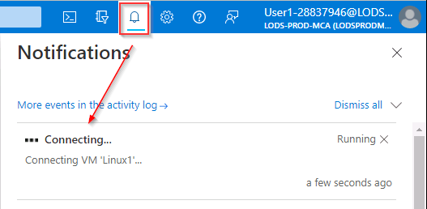

1. On the Syslog via AMA page, in the Configuration section, select **Refresh** until the data collection rule **linuxdata** is shown in the list.

    !IMAGE[E1-T2-S16-Refresh-Data-Rules.png](instructions256911/E1-T2-S16-Refresh-Data-Rules.png)

    <!-- WK-Apr 4/24 End: Adding Syslog Via AMA configuration steps -->

<!-- Hiding the unused Syslog Via Legacy agent instructions
1. On the Syslog via Legacy Connector page, in the **Configuration** section, expand the option **Install agent on Azure Linux Virtual Machine**.

    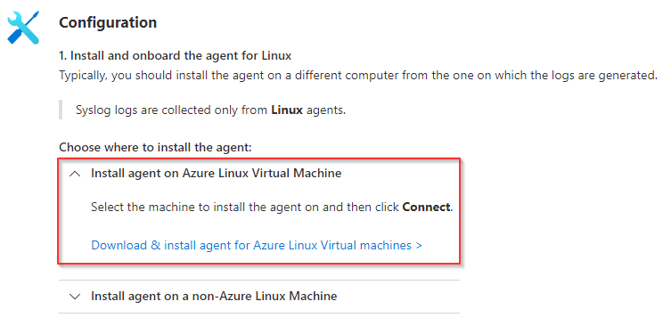

1. Select the **Download & install agent for Azure Linux Virtual machines** link.

1. From the list of Virtual machines, select the entry named **Linux1**.

    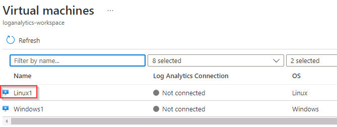

1. To complete the connection, on the Linux1 page, select **Connect**.

    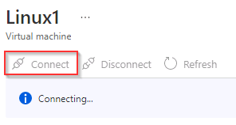}

    {: .note }
    > This process can take a couple of minutes to complete.

1. Once the connection has completed, return to the Syslog via Legacy Agent page by selecting **Syslog via Legacy Agent** in the breadcrumb navigation at the top of the page.

    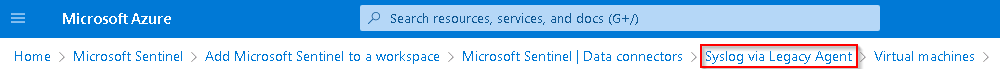

1. On the Syslog page, at the bottom of the Configuration section, select the **Open your workspace agents configuration** link.

    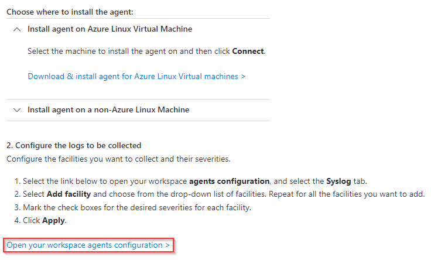

1. Select **+ Add facility** to define the facilities to collect and then select **syslog** from the list.

    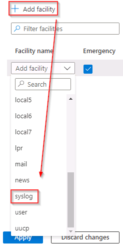{125}

1. Un-select all checkboxes except the **Notice** checkbox and then select **Apply**.

    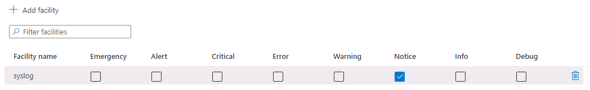
