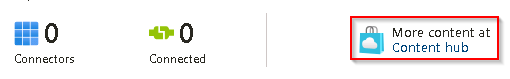

# Task 2.3: Set up a data connector for Windows

Here we'll connect Security Events via AMA and create a data collection rule for our Windows machine. The Azure Monitor agent uses data collection rules (DCR) to configure data to collect from each agent. Data collection rules enable the manageability of collection settings at scale for different groups of environments or machines, which results in lower cost and fewer events.

The following documents may help you complete this task.

- [Find your Microsoft Sentinel data connector - Microsoft Learn](https://learn.microsoft.com/en-us/azure/sentinel/data-connectors-reference#windows-security-events-via-ama)  
- [Collect Security Events in Microsoft Sentinel with the new AMA agent and DCR](https://jeffreyappel.nl/collect-security-events-in-sentinel-with-the-new-ama-agent-and-dcr/#:~:text=For%20enabling%20the%20new%20connector%2C%20take%20the%20following,Security%20events%204%20Open%20the%20connector%20page%20%283%29)  
- [Manage Azure Monitor Agent](https://learn.microsoft.com/en-us/azure/azure-monitor/agents/azure-monitor-agent-manage?tabs=azure-portal)

---

1. Return to the Microsoft Sentinel Data connectors page by selecting it in the breadcrumb navigation at the top of the page.

    

1. On the Data connectors page, select **More content at Content hub**.

    

1. On the Content hub page, select the **Provider** filter and unselect the **All** checkbox.  

1. In the **Search** box, enter +++Microsoft+++, select Microsoft, and then select **Apply**.

    

1. On the Content hub page, in the **Search** box, enter +++Windows Security Events+++, and then select Windows Security Events from the results.

1. On the Windows Security Events details page, review the description, and then select **Install**.

    

1. When the installation of the Windows Security Events connector has completed, select **Microsoft Sentinel | Data connectors** on the breadcrumb navigation at the top of the page to return to the Data connectors page.

    

1. On the Microsoft Sentinel | Data connectors page, in the **Search by name or provider** search box, enter +++Windows Security Events+++. 

    

    {: .warning }
    > If the **Windows Security Events via AMA** Data connector does not appear in the list select **Refresh** from the menu.

1. Select **Windows Security Events via AMA** connector to configure the Windows Security Events connector .

1. On the right, on the **Windows Security Events via AMA** pane, select **Open connector page**.

1. On the Windows Security Events via AMA page, in the **Configuration** section, select **+Create data collection rule**.

    

1. On the **Create Data Collection Rule** panel, on the **Basics** tab, in the **Rule Name** box, enter +++windowsdata+++.

1. Verify that the subscription is set to **@lab.CloudSubscription.Name** and the Resource Group is set to **@lab.CloudResourceGroup(RG1).Name** and then select **Next : Resources >**.

1. On the **Resources** tab, expand **@lab.CloudSubscription.Name**, and then expand **@lab.CloudResourceGroup(RG1).Name** 

1. Select the **Windows1** Virtual machine scope checkbox, and then select **Next : Collect >**.

    

1. On the **Collect** tab, leave the **All Security Events** option selected, and then select **Next : Review + create >**.

1. Once the validation has passed, on the **Review + create** tab select **Create**.

1. On the Windows Security Events AMA page, in the Configuration section, select **Refresh** until the data collection rule **windowsdata** is shown in the list.

    
