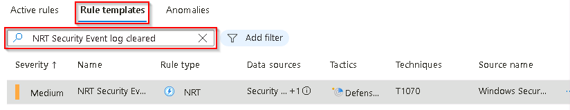

# Task 3.1: Creating a Microsoft Sentinel instance in Azure

Create an Analytics rule to handle Windows Security event log clearing incidents and create automation to report on these incidents

{: .note }
> Events are being triggered in this lab every 5 minutes, incidents should eventually appear on their own.

The following documents may help you complete this task.

- [Azure Sentinel: Using rule templates](https://techcommunity.microsoft.com/t5/itops-talk-blog/azure-sentinel-using-rule-templates/ba-p/2028427)  

---

1. Return to the Microsoft Sentinel Data connectors page by selecting it in the breadcrumb navigation at the top of the page.

    

1. On the left navigation, scroll down to **Configuration**, then select **Analytics**.

1. On the **Rule templates** tab in the **Search by ID, name, tactic or technique** box search for and select +++NRT Security Event log cleared+++.

    

1. On the **NRT Security Event log cleared** panel to the right review the details and select **Create rule**

1. On the Analytics rule wizard - Create new NRT rule page, on the **General** tab, accept the defaults and select **Next : Set rule logic >**.

1. On the **Set rule logic** tab, review the values and select **Next : Incident settings >**

1. On the **Incident settings** tab, review the values and select **Next : Automated response >**.

1. On the **Automated response** tab, select **Next : Review + create >**.

    {: .note }
    > A new automation rule will be added to this template later in this exercise.

1. Once the validation has completed successfully select **Save**
