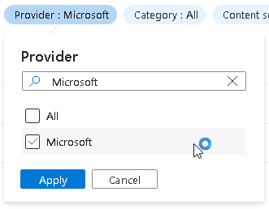

# Task 3.2: Task 2: Create a Microsoft Sentinel Playbook

In this task, you’ll create an Analytics rule to handle Linux Syslog injection compromise incidents. A playbook template is a pre-built, tested, and ready-to-use workflow that can be customized to meet your needs. Templates can also serve as a reference for best practices when developing playbooks from scratch, or as inspiration for new automation scenarios.

Playbook templates are not active playbooks themselves, until you create a playbook (an editable copy of the template) from them.

The following documents may help you complete this task.

- [Automate threat response with playbooks in Microsoft Sentinel](https://learn.microsoft.com/en-us/azure/sentinel/automate-responses-with-playbooks)
- [Create and customize Microsoft Sentinel playbooks from built-in templates](https://learn.microsoft.com/en-us/azure/sentinel/use-playbook-templates)

---

1. In the upper left, select the hamburger icon , then select **Home** to return to the Microsoft Azure home page.

1. On the Microsoft Azure Home page, under **Azure services**, select **Microsoft Sentinel**.  

    

1. On the Microsoft Sentinel page, from the list select the workspace named **LogAnalytics-workspace**.

    

    {: .note }
    > A message titled **Microsoft Sentinel free trial activated** may be displayed. You can safely select **OK** to close this dialog.

1. On the **Microsoft Sentinel** pane, in the left navigation scroll down to **Configuration**, and select **Automation**.

1. On the **Automation rules** tab scroll to the bottom of the page and select **Configure permissions**.

    

1. On the Manage permissions page select the resource group **@lab.CloudResourceGroup(RG1).Name** from the list and then select **Apply**.

    {: .note }
    > The resource group **@lab.CloudResourceGroup(RG1).Name** will be moved from the **Browse** tab to the **Current permissions** tab.

1. To return to the Microsoft Sentinel Automation page select **Cancel**.

1. On the Microsoft Sentinel Automation page select the **More content at Content hub** link.

    

1. On the Content hub page select the Provider filter and clear the **All** box

1. Search for and select +++Microsoft+++, and then select **Apply**.

    

1. On the Content hub page in the search box, search for and then select +++Watchlists Utilities+++.

1. On the **WatchlistsUtilities details** panel review the description and then select **Install**.

    

1. Return to the Microsoft Sentinel Automation page by selecting the **Microsoft Sentinel | Automation** breadcrumb navigation at the top of the page.

    

1. On the Microsoft Sentinel Automation page select the **Playbook templates (Preview)** tab.

    

    {: .warning }
    > If the list of Playbook templates does not appear in the list select **Refresh** from the menu at the top of the Microsoft Sentinel Automation page.

1. In the **Search by name** search box, search for and select +++Add Host to Watchlist - Incident Trigger+++.

    {350}

1. On the right in the **Add Host to Watchlist - Incident Trigger** panel select **Create playbook**.

    {: .note }
    > If the right panel is not visible select the **<<** icon to expand the panel.
    > 

1. On the Create playbook page, on the **Basics** tab, review the fields and select **Next : Parameters>**.

1. On the **Parameters** tab, enter the Watchlist Alias +++SecurityEventLogClear+++ and then select **Next : Connections >**.

1. On the **Connections** tab, select **Next : Review and create >**.

1. On the **Review and create** tab, review all the settings and select **Create playbook** and wait for the deployment to complete.

    {: .note }
    > You can select the **Bell** icon at the top to monitor the deployment progress.
