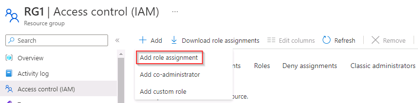
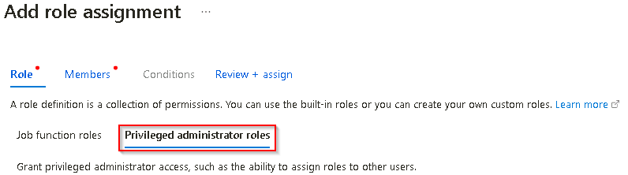
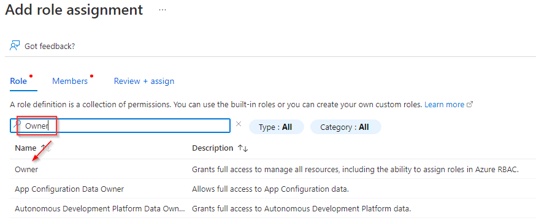
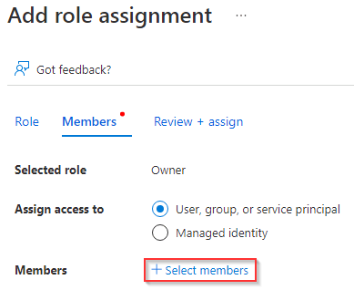
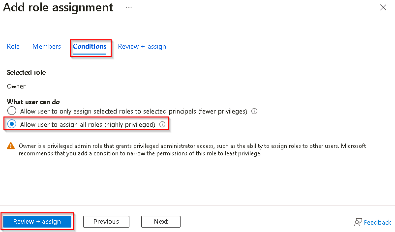
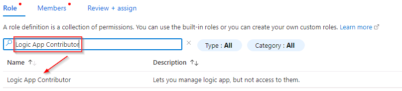
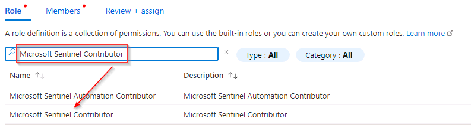
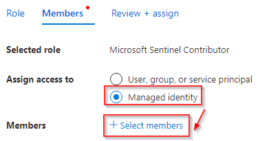
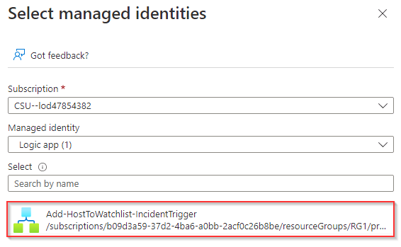

# Task 3.3: Add Role-based permission assignments

Configure roles and permissions for Microsoft Sentinel to access the appropriate services.

The following documents may help you complete this task.

- [Roles and permissions in Microsoft Sentinel](https://learn.microsoft.com/en-us/azure/sentinel/roles#other-roles-and-permissions)  
- [Assign Azure roles using the Azure portal](https://learn.microsoft.com/en-us/azure/role-based-access-control/role-assignments-portal)

---

1. For the **Owner** permissions, on the upper left, select the hamburger icon , then select **Resource groups**. 

1. On the Resource groups page, in the list of resource groups select **@lab.CloudResourceGroup(RG1).Name**.

1. On the **@lab.CloudResourceGroup(RG1).Name** pane, in the left navigation select **Access control (IAM)**.

1. On the @lab.CloudResourceGroup(RG1).Name  Access control (IAM) page, on the menu, select **+ Add** > **Add role assignment**.

    

1. On the Add role assignment page select the **Privileged administrator roles** tab.

    

1. In the **Search by role name, description, or ID** search box, search for and select +++Owner+++ and then select **Next**.

    

1. On the Add role assignment page, on the **Members** tab select **+ Select members**.

    

1. On the **Select members** panel, in the **Search by name or email address** search box, search for and select +++@lab.CloudPortalCredential(User1).Username+++ and then select **Select**.

1. On the Add role assignment page, select **Next** to progress to the **Conditions** tab.

1. In the **What user can do** option select **Allow user to assign all roles (highly privileged)** and then select **Review + assign**.

    

1. Select **Review + assign**.

1. For the **Logic App Contributor** permissions, on the @lab.CloudResourceGroup(RG1).Name Access control (IAM) page, select **+ Add** and then select **Add role assignment**.

    
    
1. In the **Search by role name, description, or ID** search box, search for and select +++Logic App Contributor+++ and then select **Next**.

    

1. On the Add role assignment page, on the **Members** tab, select **+ Select members**.

    

1. On the **Select members** panel, in the **Search by name or email address** search box, search for and select +++@lab.CloudPortalCredential(User1).Username+++ and then select **Select**.

1. On the Add role assignment page, select **Next**.

1. Select **Review + assign**.

1. For the **Microsoft Sentinel Contributor** permissions, on the @lab.CloudResourceGroup(RG1).Name Access control (IAM) page, select **+ Add** and then select **Add role assignment**.

1. In the **Search by role name, description, or ID** search box, search for and select +++Microsoft Sentinel Contributor+++, and then select **Next**.

    

1. On the Add role assignment page, on the **Members** tab, set the **Assign access to** field to **Managed identity** and then select **+ Select members**.

    

1. On the **Select managed identities** panel in the **Managed identity** field select **Logic app (1)**. 

1. Select the managed identity **Add-HostToWatchlist-IncidentTrigger** and then select **Select**.

    

1. On the Add role assignment page, select **Next** and then select **Review + assign**.
