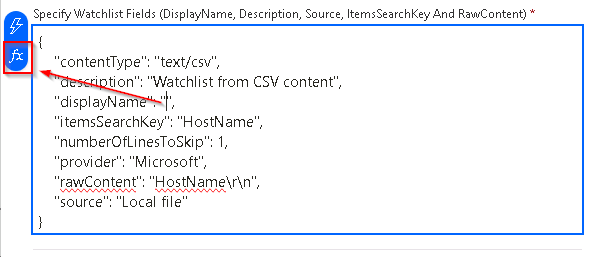

# Task 3.4: Modify the Logic app

Using a premade Logic app, Add-HostToWatchlist-IncidentTrigger, this task will walk you through the Logic app designer to modify it. Azure Logic Apps integration platform provides hundreds of prebuilt connectors so you can connect and integrate apps, data, services, and systems more easily and quickly. You can focus more on designing and implementing your solution's business logic and functionality, not on figuring out how to access your resources.

The following document may help you complete this task.

- [Manage logic apps in the Azure portal](https://learn.microsoft.com/en-us/azure/logic-apps/manage-logic-apps-with-azure-portal) 
- [Overview - Azure Logic Apps Microsoft Learn](https://learn.microsoft.com/en-us/azure/logic-apps/logic-apps-overview) 

---

1. In the Azure **Search resources, services, and docs (G+/)** search box, search for and select **Logic apps**.

    

1. On the Logic apps page, select the logic app named **Add-HostToWatchlist-IncidentTrigger**.

1. On the Add-HostToWatchlist-IncidentTrigger page, in the left navigation, under **Development Tools** select **Logic app designer**.

1. Under the **Condition - is watchlist available - MDFC** box follow the logic flow under the **False ^** label to the bottom of the tree

    

1. Scroll to the bottom of the designer and select the last blue box labelled **Watchlists - Create a new watchlist with data** to expand it.

    
    
1. Replace the **Specify Watchlist Fields** with the following text:

    ```
    {
        "contentType": "text/csv",
        "description": "Watchlist from CSV content",
        "displayName": "",
        "itemsSearchKey": "HostName",
        "numberOfLinesToSkip": 1,
        "provider": "Microsoft",
        "rawContent": "HostName\r\n",
        "source": "Local file"
    }
    ```

1. In the **Specify Watchlist Fields** field, place the cursor in the value section of the **displayName** key pair and then display the **Insert Expression** dialog by selecting the **fx** icon.

    

1. Select the **Dynamic content** tab and then search for, and select, the variable **Watchlist alias**.

1. To insert the variable definition into the Watchlist Fields select **Add**.

    

1. In the **Specify Watchlist Fields** field, place the cursor in the value section of the **rawContent** key pair before the closing quote and then display the **Insert Expression** dialog by selecting the **fx** icon.

1. Select the **Dynamic content** tab and then search for, and select, the Entity **Hosts Hostname**.

1. To insert the variable definition into the Watchlist Fields select **Add**.

    

1. Verify that the contents of the **Specify Watchlist fields** field match the following image and then select **Save**:

    
