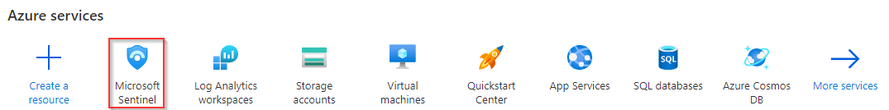
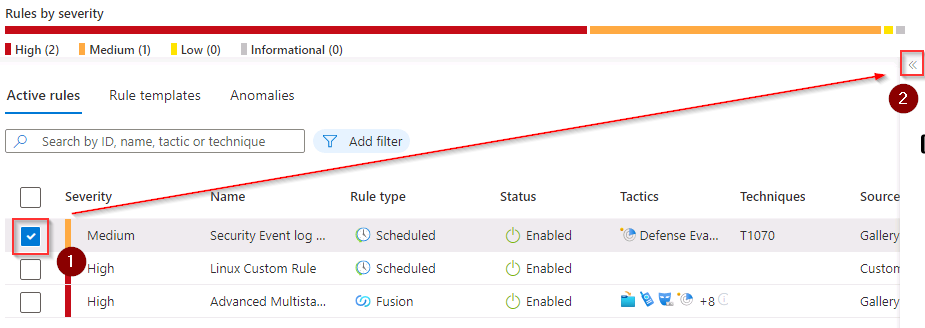
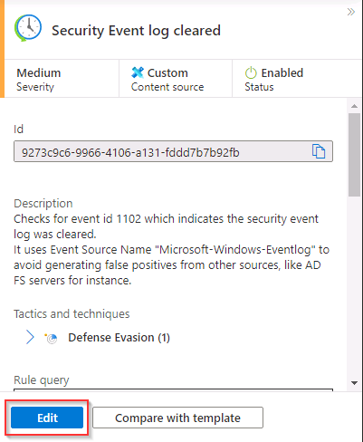
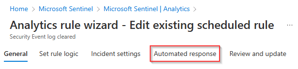
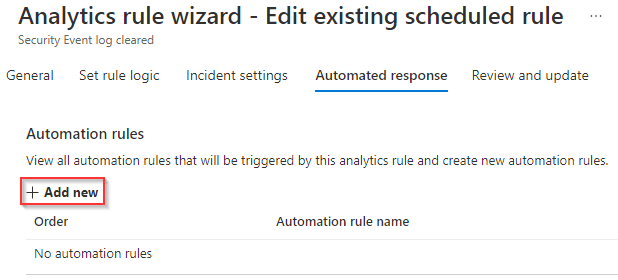
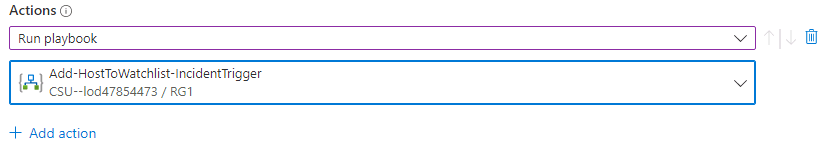

# Task 3.5: Add automation to the Windows Security event log clear incident

In this task, you’ll configure the Windows data connector to be linked to the modified Logic app. Automation rules streamline the use of automation in Microsoft Sentinel, enabling you to simplify complex workflows for your threat response orchestration processes.

The following document may help you complete this task.

- [Automate threat response in Microsoft Sentinel with automation rules](https://learn.microsoft.com/en-us/azure/sentinel/automate-incident-handling-with-automation-rules)
- [Create and use Microsoft Sentinel automation rules to manage response](https://learn.microsoft.com/en-us/azure/sentinel/create-manage-use-automation-rules) 

---

1. In the upper left, select the hamburger icon , then select **Home** to return to the Microsoft Azure home page.

1. On the Microsoft Azure Home page, under **Azure services**, select **Microsoft Sentinel**.  

    

1. On the Microsoft Sentinel page, select **LogAnalytics-workspace**.

1. On the left navigation, under **Configuration** select **Analytics**.

1. From the list of Active rules, select the Medium severity rule named **NRT Security Event log cleared**. 

    {: .note }
    > If necessary, open the **Active rules details** panel on the right by selecting the **<<** icon.
    >
    >  

1. On the **Security Event log cleared details** panel, select **Edit**.

    

1. On the Analytics rule wizard - Edit existing scheduled rule page, on the **General** tab, review the fields and select the **Automated response** tab.

    

1. On the **Automated response** tab select **+ Add new**.

    

1. In the **Create new automation rule** panel, set the **Automation rule name** to **WinWatchlist**.

1. Set the first value in **Actions** to **Run playbook**.

1. In the second value in **Actions**, select the **Add-HostToWatchlist-IncidentTrigger** playbook.

    
    
1. Review the rest of the fields and select **Apply**.

1. On the Automated response tab, select **Next : Review + create >**.

1. Once the Validation process has completed successfully select **Save**.
