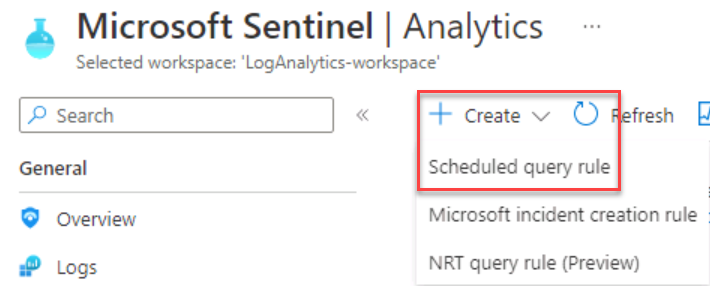
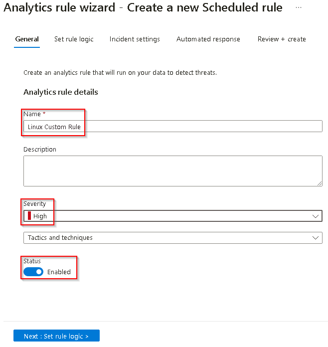
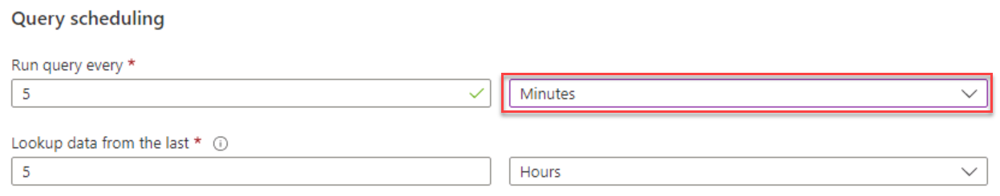
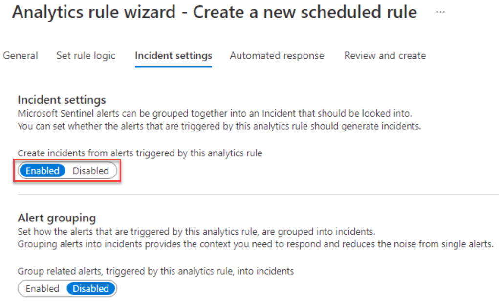
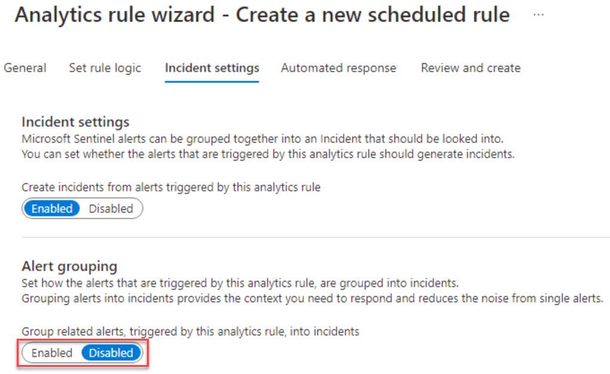
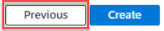

# Task 3.6: Configure an Azure Analytics rule for Linux

Using Sentinel, create a new high priority Scheduled Query Rule for Linux. 

The following documents may help you complete this task.

- [Create custom analytics rules to detect threats](https://learn.microsoft.com/azure/sentinel/detect-threats-custom)  
- [Collect data from Linux-based sources using Syslog](https://learn.microsoft.com/azure/sentinel/connect-syslog)  
- [Data collection best practices](https://learn.microsoft.com/azure/sentinel/best-practices-data)

---

1. On the Microsoft Sentinel Analytics page, select **+ Create** > **Scheduled query rule**.  

    

1. On the Analytics rule wizard - Create a new scheduled rule, on the General tab, under **Analytics rule details** complete the form using the values in the table below:

    | Field | Value |
    |:----|:----|
    | Name | **+++Linux Custom Rule+++** |
    | Severity | **High** |
    | Status | **Enabled** |

    

1. Select **Next: Set rule logic**.

1. On the **Set rule logic** tab, in the **Rule query** box, enter the following query.

    ```Rule-query-wrap-nocolor
    Syslog  | where Facility contains "syslog" |where ProcessID == "65536" | project HostName, HostIP, Computer, TimeGenerated, SourceSystem
    ```

    {: .note }
    > This query searches for the event code that triggers an incident in Sentinel.
    
1. Under **Query scheduling**, set **Run query every** to **5 minutes**.  

    

1. To configure the Incident settings select **Next : Incident settings >**.

1. On the **Incident settings** tab, under **Incident settings**, verify that **Create incidents from alerts triggered by this analytics rule** is set to **Enabled**.  

    

1. Under **Alert grouping**, verify that **Group related alerts, triggered by this analytics rule, into incidents**, is set to **Disabled** and then select **Next: Automated response >**.  

    

1. On the **Automated response** tab select **Next: Review + create**.

1. On the **Review and create** tab, after validation completes, review the settings, then select **Save**. 

    {: .note }
    > Upon review, if any of the settings are incorrect, select **Previous** to return to the appropriate tab.  
    >
    >

1. Once complete, the Microsoft Sentinel Analytics page will display. 
