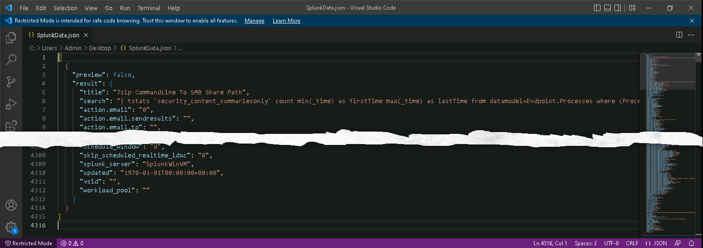

# Task 4.1: Export the Splunk data

Exporting Splunk data is a straightforward process. For easiest migration it is best to use the json data format. Also, pay attention when identifying the desired rules to be migrated as not all rules can be converted to Azure Sentinel data analytics rules.

{: .warning }
> You will not require Splunk to complete this task for this lab.  These instructions assume that you have access to Splunk and are familiar with the process required to export the data.

The following document provides more information regarding the process of exporting and migrating Splunk data to Azure Sentinel.

- [Migrate Splunk detection rules to Microsoft Sentinel](https://learn.microsoft.com/en-us/azure/sentinel/migration-splunk-detection-rules)

---

1. Sign in to @lab.VirtualMachine(Windows 11).SelectLink using these credentials:

    | | |
    |:--|:--|
    | Username | **@lab.VirtualMachine(Windows 11).Username** |
    | Password | **@lab.VirtualMachine(Windows 11).Password** |

1. Simulate the export of the Splunk data to the **SplunkData.json** file by selecting the Export button here:

    @lab.Activity(unhideSplunkFile)

1. Open the exported Splunk data file, **SplunkData.json** using Visual Studio Code or a simple text editor like Notepad, and verify that the file contains a valid JSON object.

    

1. Search the Splunk data file for the following entries. These will be used as part of the validation exercise.

    - AWS CreateAccessKey
    - Multiple Okta Users With Invalid Credentials From The Same IP
    - 7zip CommandLine To SMB Share Path
    - CIM - Top Data Model Accelerations
    - CIM - Top Data Model Accelerations by Run Duration
