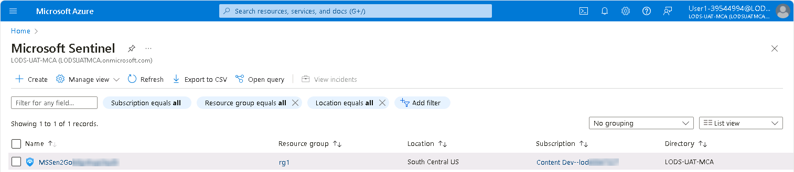
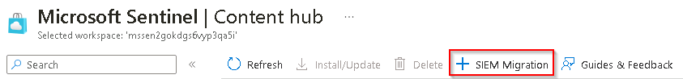
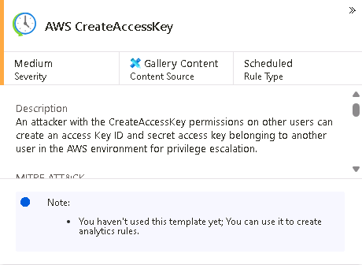
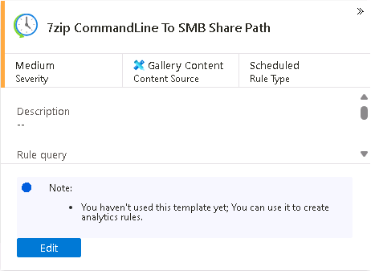
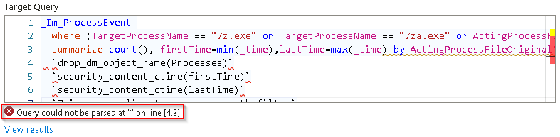
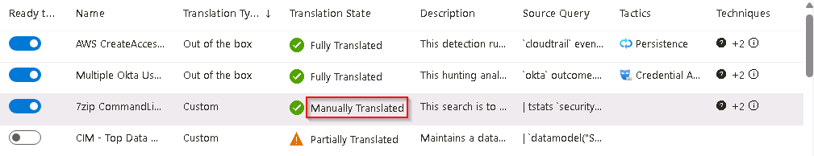
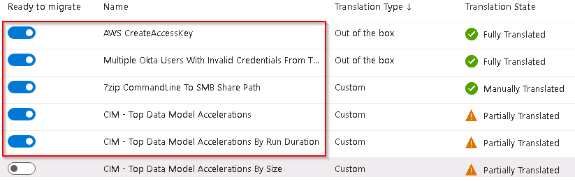
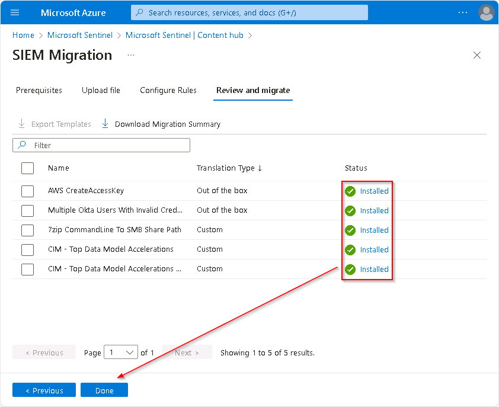

# Task 1.2: Import the Splunk data into Azure Sentinel using SIEM Migration

SIEM migration in Azure Sentinel removes the complexity of converting data analytics rules from the Splunk data rules import process.

The following document may help you complete this task.  

- [Migrate to Microsoft Sentinel with the SIEM migration experience](https://learn.microsoft.com/en-us/azure/sentinel/siem-migration)

---

1.  Open Microsoft Edge, go to the **[Azure Portal](https://portal.azure.com)** then sign in using these credentials:

    | | |
    |:--|:--|
    | Username | **@lab.CloudPortalCredential(User1).Username** |
    | Password | **@lab.CloudPortalCredential(User1).Password** |

    {: .warning }
    > If you encounter the **Welcome to Microsoft Azure** screen select **Get started** and then select **Skip** on the next two screens.

1.  In the **Stay signed in?** dialog box, select the **Don't show this again** box and then select **Yes**.

    {: .note }
    > If you encounter the **Welcome to Microsoft Azure** page select the **Get started** button and then select **Skip** on the next two pages to bypass the survey and Azure tour.

1.  In the search bar of the Azure portal, enter and select **Microsoft Sentinel**.

1.  Select the Sentinel instance with the prefix **MSSen2Go...** from the list.

    

1.  On the **Microsoft Sentinel** menu, under **Content management**, select **Content hub**.

1.  On the **Content hub** menu, select **SIEM Migration**.

    

1.  On the **Prerequisites** tab, review the prerequisites necessary for Splunk data import, and then select **Next: Upload file >**.

    {: .note }
    > The instructions provided at the top of the **Upload file** tab provide details on how to export the data from the Splunk instance. This lab assumes that this step has already been completed.

1.  Open **Windows File Explorer**, then go to the **C:\Users\Admin\Desktop** folder.

1.  Drag the **SplunkData.json** file to the **Upload file** box in Edge.

    A green circle with a checkmark next to the filename will indicate that the file has been appropriately selected.

    {: .note }
    >Alternatively, you can select the **Browser for files** link in the **Upload file** section to navigate to, and select, the **C:\Users\Admin\Desktop\SplunkData.json** file.

1.  Select **Next : Configure Rules >** to upload the Splunk data file and define the migration rules.

    {: .note }
    > Some rules will be fully recognized and translated while some may only be partially translated or failed. Partially translated rules may require updates to fully migrate the information to Sentinel. Failed translations will not be recognized by Sentinel.

1.  On the **Configure Rules** tab, in the **Name** column, select the **AWS CreateAccessKey** rule entry that has a Translation State status of **Fully Translated**.   

    {: .note }
    > Make sure the **Translation State** is **Fully Translated**.  
    
1.  On the **AWS CreateAccessKey** pane, review the details of the translated rule, including the rule query, run frequency and other parameters. 

      

1.  Select the **7zip CommandLine To SMB Share Path** rule entry that has a Translation State status of **Partially Translated**.  

1.  On the **7zip CommandLine To SMB Share Path** pane, review the details of the partially translated rule, then select **Edit**.

    

1.  On the **Edit SIEM migration rule** pane, under the **Target Query** box, note the following error message. It indicates that an error was detected in the Kusto Query Language (KQL) query.

    

1.  If you're familiar with this issue, modify the Target query to correct the query.

1.  If you're not sure how to correct the query, use the following steps:

    {: .note }
    > To attempt to translate the Splunk query to MS KQL you can use Copilot AI or other tools to do the work for you.

    1.  In the **Source Query** box, highlight and then copy the entire query.

    1.  Open a new tab in Edge.

    1.  Go to **[http://copilot.microsoft.com](http://copilot.microsoft.com)** to access Microsoft Copilot.

    1.  In the chat box type:

        >**translate this splunk rule to KQL:**
    
    1.  On a new line in the chat box paste the **Source Query** copied previously and then **submit** the text.

    1.  Copy the resulting KQL query from Copilot and paste it into the **Target Query** box on the **Edit SIEM migration rule** pane.

        {: .note }
        > A new error will be displayed under the **Target Query** box. This error indicates that a table couldn't be resolved. This table may not exist in Sentinel which will prevent the successful execution of this rule.

    1.  To complete the update select **Save Changes**.

1.  The Translation State of the **7zip CommandLine To SMB Share Path** SIEM rule has changed from **Partially Translated** to **Manually Translated**. 

    

1.  In the **SIEM Migration** rules list ensure that the **Ready to migrate** switch has been enabled for the following rules and then select **Next : Review and migrate >**.

    - AWS CreateAccessKey
    - Multiple Okta Users With Invalid Credentials From The Same IP
    - 7zip CommandLine to SMB Share Path
    - CIM - Top Data Model Accelerations
    - CIM - Top Data Model Accelerations by Run Duration

    

1.  Review the list of SIEM Migration rules to ensure that the appropriate rules have been selected and then select **Deploy**.

    {: .note }
    >It may take a couple of minutes to complete the installation of the queries into Sentinel and build out the analytics rules.

1.  Once the installation of all the SIEM Migration rules has completed select **Done** to return to the **Microsoft Sentinel - Content hub** panel.

    

1. On the confirmation screen select **OK** to complete the migration.

    {: .note }
    > You can download a summary of the migration session by selecting the **Download Migration Summary** link prior to completing the migration. However, this step is not required to complete the SIEM Migration of Splunk data into Sentinel.
