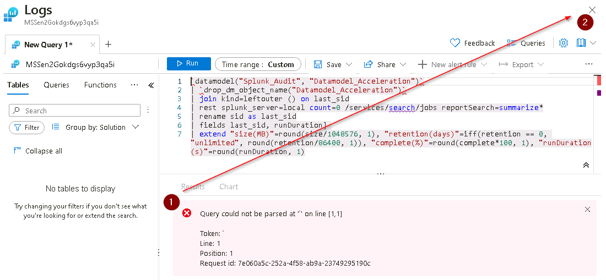

# Task 5.1: Verify the Splunk data migration into Sentinel

You'll explore the migrated Splunk data using the Sentinel analytics rule wizard to verify the converted rules in your environment. 

---

1.  On the **Microsoft Sentinel** menu, under **Configuration**, select **Analytics**.

    

    {: .warning }
    > You may encounter an error message indicating that one or more Codeless Connectors are not valid. The **Amazon Web Services** connector is not properly defined. This error can be ignored for this lab.
    >
    >

1.  On the **Active rules** tab, note that the imported Splunk rules are shown in the list with the prefix **[Splunk Migrated]**.

    

1.  Select the **Name** column heading to sort the Active rules list by name.

1.  Select the third rule, **[Splunk Migrated] CIM - Top Data Model Accelerations**, to display the details in the right panel.

    {: .note }
    > If the right panel is not displayed select the **<<** icon on the right side to display it.

1.  On the right panel select **Edit** to modify the selected analytics rule.

1.  Select **Next : Set rule logic** to display the rule query and parameter details.

1.  In the Rule query section select the **View query results >** link to display the **Logs** query dialog panel.

      

    {: .note }
    > Notice that this query isn't a proper KQL query which is indicated by the error that's displayed in the **Results** section.

1.   Select the **X** icon at the top right (not the browser "X") to close the **Logs** query dialog panel and then select **OK** to discard any edits.

     

1.  Select the **X** icon at the top right (not the browser "X") to close the **Analytics rule wizard** dialog.

1.  Select the **[Splunk Migrated] AWS CreateAccessKey** entry in the list to display the details in the right panel.

    {: .note }
    > If the right panel is not displayed select the **<<** icon on the right side to display it.

1.  Select **Edit** to display the **Analytics rule wizard** dialog and then select **Next : Set rule logic >**.

1.  Select the **View query results >** link to display the **Logs** query dialog panel.  

    Since there are no errors associated with this we can expect the query to complete successfully.

1.  Select the **Run** button to execute the Analytics rule query.

    {: .note }
    > This query completes correctly but returns no results at this time. The KQL query is properly formatted and no issues in the schema are surfaced.
