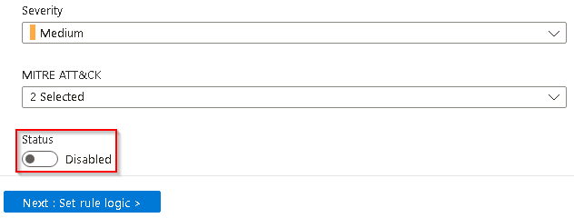
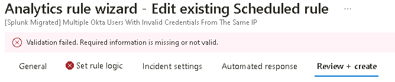
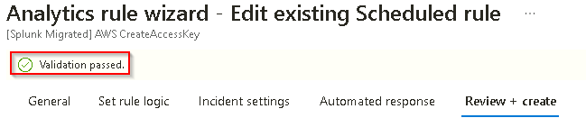
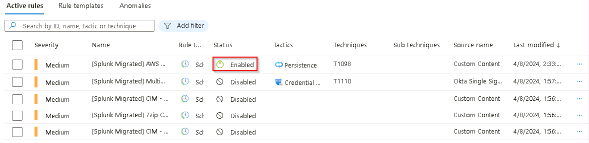

# Task 2.2: Enable migrated Splunk rules in Sentinel

Now that the Splunk data rules have been imported, converted and verified in Microsoft Sentinel, we'll need to enable the rules so that Sentinel can take over the detection of incidents in your environment.

The following document may help you complete this task.  

- [Enable an Azure Activity rule](https://github.com/Azure/Azure-Sentinel/blob/master/Solutions/Training/Azure-Sentinel-Training-Lab/Modules/Module-3-Analytics-Rules.md)

---

1.  Return to the **Microsoft Sentinel - Analytics** panel.

1.  Select the **[Splunk Migrated] Multiple Okta Users With Invalid Credentials From The Same IP** entry in the list to display the details in the **[Splunk Migrated] Multiple Okta Users With Invalid Credentials From The Same IP** pane.

    {: .note }
    > If the right panel is not displayed select the **<<** icon on the right side to display it.

1.  On the **[Splunk Migrated] Multiple Okta Users With Invalid Credentials From The Same IP** pane, select **Edit**.

1.  Change **Status** from **Disabled** to **Enabled** and then select the **Review + create** tab.

    

    {: .note }
    >If there's an error in the query it will fail the validation and can't be enabled.
    >
    > 

1.  Return to the **Microsoft Sentinel - Analytics** panel and select the **[Splunk Migrated] AWS CreateAccessKey** entry in the list to display the details in the **[Splunk Migrated] AWS CreateAccessKey** pane.

1.  On the right panel select **Edit** to edit the selected analytics rule.

1.  Change the **Status** from **Disabled** to **Enabled** and then select the **Review + create** tab.

    {: .note }
    >This rule does not contain any issues in the Query and will pass validation
    >
    >

1.  Once the Analytics rule has been validated select **Save** to commit the update of the Analytics rule and then return to the **Microsoft Sentinel - Analytics** pane.

    {: .note }
    >The Status of the updated Analytics rule in the list should now be updated to **Enabled**. If it hasn't been updated select the **Refresh** link in the top menu to update the list.
    >
    > 
