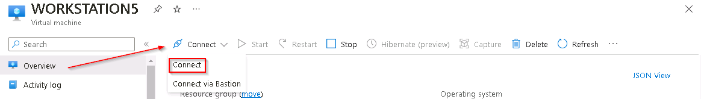
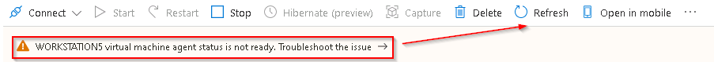
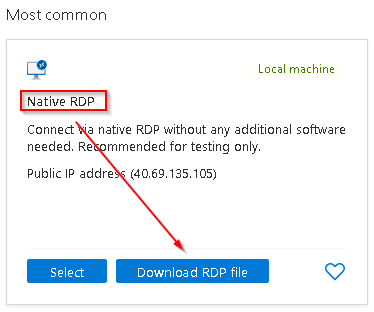
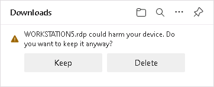
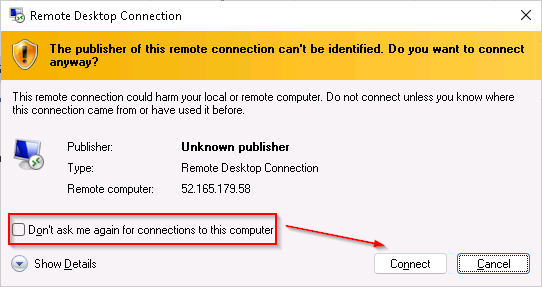
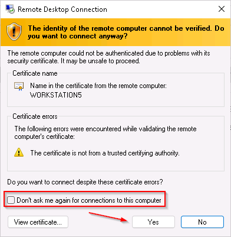

# Task 7.1: Target machine setup


In this task, you'll configure a Remote Desktop connection to the target machine on which the attacks will be performed.

The following document may help you understand RDP connections to Azure virtual machines.

- [Connect to Azure Virtual Desktop with the Remote Desktop client for Windows](https://learn.microsoft.com/en-us/azure/virtual-desktop/users/connect-windows?pivots=remote-desktop-msi)

---

1.  Sign in to @lab.VirtualMachine(Windows 11).SelectLink using these credentials:

    | | |
    |:--|:--|
    | Username | +++@lab.VirtualMachine(Windows 11).Username+++ |
    | Password | +++@lab.VirtualMachine(Windows 11).Password+++ |

1.  Open Microsoft Edge, go to +++https://portal.azure.com+++, then sign in using these credentials:
    | | |
    |:--|:--|
    | Username | +++@lab.CloudPortalCredential(User1).Username+++ |
    | Password | +++@lab.CloudPortalCredential(User1).Password+++ |

    {: .warning }
    > If you encounter the **Welcome to Microsoft Azure** screen select **Get started** and then select **Skip** for the next two screens.

1.  On the Microsoft Azure Home page, in the **Azure services** section, select **Virtual machines**.

1.  In the list of virtual machines select the entry named **WORKSTATION5**.

1.  On the **WORKSTATION5 Overview** pane, select the **Connect** link from the upper menu and then select **Connect**.

    

    > **Note:** In order to be connected, the Virtual Machine must be in a started and running status. 
    >
    > If the Virtual Machine is not running, you can select the **Start** option from the menu to start the VM.
    >
    > If you encounter an *agent status is not ready* message wait a few minutes and select **Refresh** from the menu.
    > 

1.  On the **WORKSTATION5 | Connect** pane in the **Native RDP** tile select **Download RDP file**.

    

1.  To save the RDP file to the downloads folder, in the **Downloads** dialog, select **Keep**.

    

1.  To initiate the Remote Desktop session to the WORKSTATION5 Azure VM select the downloaded **WORKSTATION5.rdp** file from the +++C:\Users\Admin\Downloads+++ folder.

1.  To complete the connection, in the **Remote Desktop Connection** dialog box select **Don't ask me again for connections to this computer** and then select **Connect**.

    

1.  To log in to the **WORKSTATION5** VM sign in using these credentials:
    | | |
    |:--|:--|
    | Username | +++WinAdmin+++ |
    | Password | +++Passw0rd!1234+++ |

1.  On the **Remote Desktop Connection** dialog box select **Don't ask me again for connections to this computer** and then select **Yes**.

    

    {: .note }
    > **Note:** It may take some time for the login to complete.
    >
    > Also, because this VM has been set up as part of the startup of this lab you may have to complete the **Getting Started** survey. To complete the survey, select **Next** and then select **Accept**.

1.  In the search of the task bar, enter +++command+++. Command Prompt will be displayed in the search results. 

1.  To allow the app to run, select **Run as Administrator** and then, in the User Account Control window that appears, select **Yes**.

1.  In the Command Prompt, create a Temp folder in the root directory using the following commands and press **Enter**.

    ```CommandPrompt
    cd \
    mkdir temp
    cd temp
    ```
