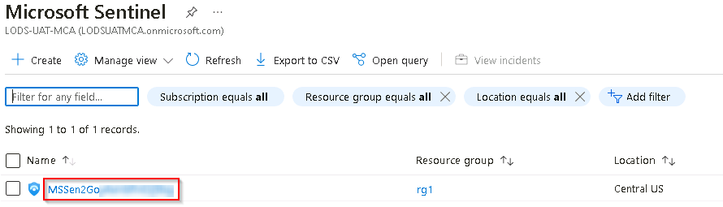

# Task 7.2: Connect the target machine to Microsoft Sentinel - All Events DCR

In this task, you'll connect the target machine on which the attacks will be performed to Microsoft Sentinel using the built-in *All Security Events* data collection rule.

The following document may help you understand Sentinel data connectors for Windows virtual machines.

- [Connect Windows devices to Microsoft Sentinel using data connectors](https://microsoftlearning.github.io/SC-200T00A-Microsoft-Security-Operations-Analyst/Instructions/Labs/LAB_AK_06_Lab1_Ex2_Connect_Windows.html)

---

1.  Minimize the RDP session to return to the @lab.VirtualMachine(Windows 11).SelectLink VM.

1.  If necessary, open Microsoft Edge, go to the [Azure portal](https://portal.azure.com), then sign in using these credentials:

    | | |
    |:--|:--|
    | Username | **@lab.CloudPortalCredential(User1).Username** |
    | Password | **@lab.CloudPortalCredential(User1).Password** |

    {: .warning }
    > If you encounter the **Welcome to Microsoft Azure** screen, select **Get started** and then select **Skip** for the next two screens.

1.  In the search bar of the Azure portal, type **Microsoft Sentinel**, then select **Microsoft Sentinel** from the results.

1.  In the list of Microsoft Sentinel Workspaces, select the workspace named **MSSen2Go\***.

    

1.  In the Microsoft Sentinel left menu, scroll down to the **Content management** section and select **Content hub**.

1.  On the **Content hub** panel in the **Search...** field search for the **Windows Security Events** solution and then select it from the list.

1.  On the **Windows Security Events** panel to the right, select **Install** and wait for the installation job to complete.

    {150}

    {: .note }
    > The Windows Security Events solution installs both the Windows Security Events via AMA and the Security Events via Legacy Agent Data connectors. Plus two Workbooks, 20 Analytic Rules, and 43 Hunting Queries.

1.  When the installation completes, select **Windows Security Events** from the list and then, in the right blade, select **Manage**.

    {: .note }
    > You can monitor the status of the Install job from the Bell notifications icon at the top of the Microsoft Azure page
    >
    >

1.  On the **Windows Security Events** blade, in the Content list, select the **Windows Security Events via AMA** data connector.

1.  On the **Data connectors** blade, select the **Windows Security Events via AMA** connector, then select **Open connector page**.

    

1.  In the **Configuration** section, select **+Create data collection rule**.

    

1.  On the **Create Data Collection Rule** blade, in the **Basic** tab, use the following table to complete the fields and then select **Next: Resources >**.
   
    |||
    |:---|:---|
    |Rule name|**WindowsDCR**|
    |Subscription|**@lab.CloudSubscription.Name**|
    |Resource group|**@lab.CloudResourceGroup(RG1).Name**|

1.  On the **Resources** tab expand the **@lab.CloudSubscription.Name** subscription scope, then expand the **@lab.CloudResourceGroup(RG1).Name** resource group scope, then select the virtual machine **WORKSTATION5**.

    

1.  Select **Next: Collect >**.

1.  On the **Collect** tab ensure that **All Security Events** is selected and then select **Next: Review + create >**.

1.  On the **Review + create** tab, wait for the validation to pass and then select **Create**

1.  When the data collection rule has been properly created you'll be returned to the **Windows Security Events via AMA** page. In the **Configuration** section select **Refresh** to display the newly created data collection rule in the list.

    
