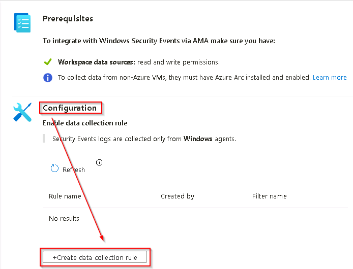
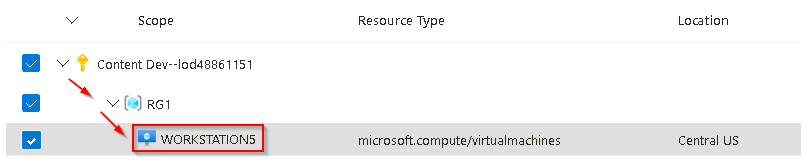

# Task 2.3: Connect the target machine to Microsoft Sentinel - Custom Events DCR

In this task, you'll connect the target machine on which the attacks will be performed to Microsoft Sentinel using a custom data collection rule targeting specific Windows Event IDs.

---

1.  On the **Windows Security Events via AMA** blade in the **Configuration** section, select **+Create data collection rule**.

    

1.  On the **Create Data Collection Rule** blade, in the **Basic** tab, use the following table to complete the fields and then select **Next: Resources >**.

     |||
    |:---|:---|
    |Rule name|**CustomDCR**|
    |Subscription|**@lab.CloudSubscription.Name**|
    |Resource group|**@lab.CloudResourceGroup(RG1).Name**|

1.  On the **Resources** tab expand the **@lab.CloudSubscription.Name** subscription scope, then expand the **@lab.CloudResourceGroup(RG1).Name** resource group scope, then select the virtual machine **WORKSTATION5**.

    

1.  Select **Next: Collect >**.

1.  To save the custom event expressions to the data collection rule, on the **Collect** tab, in the *Select which events to stream* section, select **Custom**, enter the following event list in the custom box and then select **Add**.

    **"Security!\*[System[(EventID=5136 or EventID=5139)]]","Security!\*[System[(EventID=5137)]]","Security!\*[System[(EventID=5141)]]","Security!\*[System[(EventID=4662 or EventID=4661)]]","Security!\*[System[(EventID=4768 or EventID=4769)]]","Security!\*[System[(EventID=4688)]]**

1.  Advance to the next tab by selecting **Next: Review + create >**.
1.  On the **Review + create** tab wait for the validation to pass and then select **Create**

1.  When the data collection rule has been properly created you will be returned to the **Windows Security Events via AMA** page. In the **Configuration** section select **Refresh** to display the newly created data collection rule in the list.
