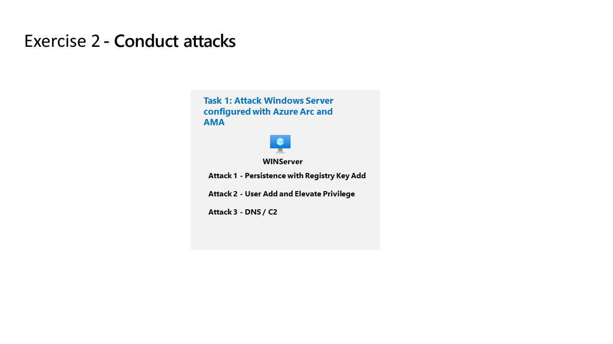

# Exercise 8: Conduct attacks

## Lab scenario

<!--

-->

You're going to simulate the attacks that you'll later use to detect and investigate in Microsoft Sentinel.

{: .note }
> An **[interactive lab simulation](https://mslabs.cloudguides.com/guides/SC-200%20Lab%20Simulation%20-%20Perform%20simulated%20attacks)** is available that allows you to click through this lab scenario at your own pace. You may find slight differences between the interactive simulation and the hosted lab, but the core concepts and ideas being demonstrated are the same. 
