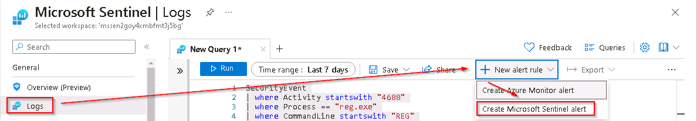

# Task 9.1: Persistence attack detection

{: .note }
> **Important:** The next steps are done with a different machine than the one you were previously working with. Look for the virtual machine name references.

In this task, you'll create a detection for the first attack of the previous exercise, a persistence attack.

The following document may help you understand detecting persistent threat attacks.

- [Microsoft Sentinel SOC 101: How to Detect and Mitigate Advanced Persistent Threats (APTs) with Microsoft Sentinel](https://rodtrent.substack.com/p/microsoft-sentinel-soc-101-how-to-07c)

---

1.  Minimize the RDP session to return to the @lab.VirtualMachine(Windows 11).SelectLink VM.

1.  If necessary, open Microsoft Edge, go to +++https://portal.azure.com+++, then sign in using these credentials:

    | | |
    |:--|:--|
    | Username | +++@lab.CloudPortalCredential(User1).Username+++ |
    | Password | +++@lab.CloudPortalCredential(User1).Password+++ |

    {: .warning }
    > If you encounter the **Welcome to Microsoft Azure** screen, select **Get started** and then select **Skip** for the next two screens.

1.  In the search bar of the Azure portal, type +++Sentinel+++, then select **Microsoft Sentinel** from the results.

1.  In the list of Microsoft Sentinel Workspaces, select the workspace named **MSSen2Go\***.

    

1.  On the Microsoft Sentinel pane, under **General** select **Logs**.

1.  Close the **Welcome to Log Analytics** window by selecting the associated **X** icon at the upper right.

    

1.  Close the **Queries** window by selecting the associated **X** icon at the upper right.

    

1.  Verify that the *SecurityEvent* table is being populated with the specific Process event (EventId = 4688) enter the following KQL statement in the query space and select **Run**.

    ```KQL
    SecurityEvent
    | where Activity startswith "4688"
    | where AccountType == "User"
    | where CommandLine startswith "REG"
    ```

    {: .warning }
    > **Warning:** Do not proceed until this query returns valid results. It can take up to 10 minutes for the SecurityEvent table to retrieve the initial event.

1.  To recall the tables where we have this data, replace the text in the query window with the following  KQL statement and select **Run**.

    ```KQL
    search "temp\\startup.bat"
    ```

1.  The table *SecurityEvent* looks to have the data already normalized and easy for us to query. Expand the row to see all the columns related to the record.

    

1.  From the results, we now know that the Threat Actor is using reg.exe to add keys to the Registry key and the program is located in C:\temp. **Run** the following statement to replace the *search* operator with the *where* operator in our query:

    ```KQL
    SecurityEvent 
    | where Activity startswith "4688" 
    | where Process == "reg.exe" 
    | where CommandLine startswith "REG" 
    ```

1.  It's important to help the Security Operations Center Analyst by providing as much context about the alert as you can. This includes projecting Entities for use in the investigation graph. **Run** the following query:

    ```KQL
    SecurityEvent 
    | where Activity startswith "4688" 
    | where Process == "reg.exe" 
    | where CommandLine startswith "REG" 
    | extend timestamp = TimeGenerated, HostCustomEntity = Computer, AccountCustomEntity = SubjectUserName
    ```

    {: .note }
    > **Note:** Do not modify the **Start running** settings. Changing this to run at a specific time in the future will delay the initial execution of the Sentinel alert. This may be desirable in real-world scenarios but could prevent the successful completion of this lab.

1.  Now that you have a good detection rule you can create a new scheduled rule. In the Logs window, select the **+ New alert rule** in the command bar and then select **Create Microsoft Sentinel alert**.

    

    {: .note }
    > **Note:** You might need to select the ellipsis (...) button in the command bar.

1.  On the Analytics rule wizard, **General** tab, complete the fields using the following table and then select **Next : Set rule logic >**:

    |Setting|Value|
    |---|---|
    |Name|+++Startup RegKey+++|
    |Description|+++Startup RegKey in c:\temp+++|
    |Severity|High|
    |Tactics|+++Persistence+++|

1.  On the **Set rule logic** tab, the **Rule query** should be populated already with a KQL query. Use the following table to verify the entities under **Alert enhancement - Entity mapping**.

    |Entity|Identifier|Data Field|
    |:----|:----|:----|
    |**Account**|+++FullName+++|+++AccountCustomEntity+++|
    |**Host**|+++Hostname+++|+++HostCustomEntity+++|

    

    {: .note }
    > **Note:** If the values don't appear in this section, add them from the drop down fields.

1.  In the **Query scheduling** section complete the fields using the following table:

    |Setting|Value|
    |---|---|
    |Run Query every|5 minutes|
    |Lookup data from the last|1 Days|

    

    {: .note }
    > **Note:** We're purposely generating many incidents for the same data. This enables the lab to use these alerts.

1.  Leave the rest of the options with the defaults values. Select the **Next: Incident settings>** button.

1.  For the **Incident settings** tab, leave the default values and select the **Next: Automated response >** button.

1.  On the **Automated response** tab under **Automation rules**, select **Add new**.

    

1.  Use the settings in the table to configure the automation rule and select **Apply**.

    |Setting|Value|
    |:----|:----|
    |Automation rule name|+++Startup RegKey+++|
    |Trigger|When incident is created|
    |Actions|Add task|
    |Task Title|+++Send Email+++|

    {: .note }
    > **Note:** You can define one or more actions to be run as a result of the trigger including **Playbooks** which are the preferred action container. Playbooks are efficient and effective modules that can be configured to provide various functions including sending an email notification, shutting down a machine, or any number of security administration actions. 

    

1.  On the **Automated response** tab select the **Next: Review + create >** button.
  
1.  On the **Review + create** tab, when the configuration has been validated, select **Save** to create the new scheduled Analytics rule.
