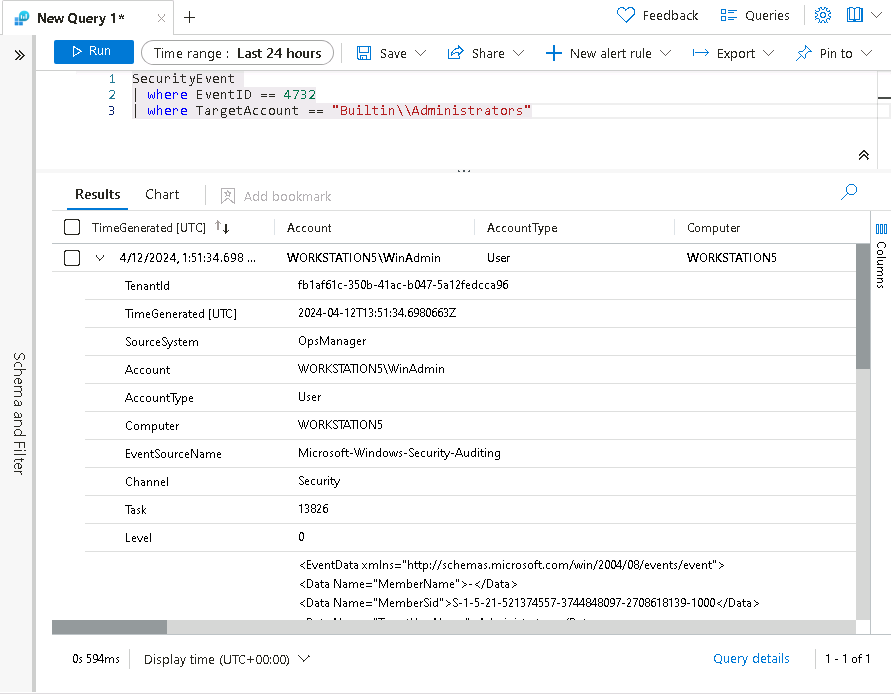
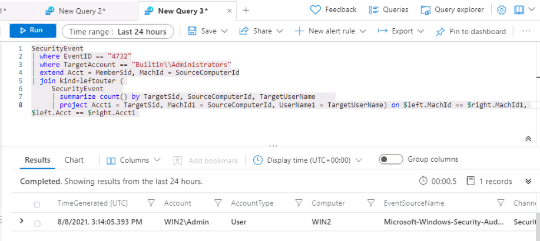
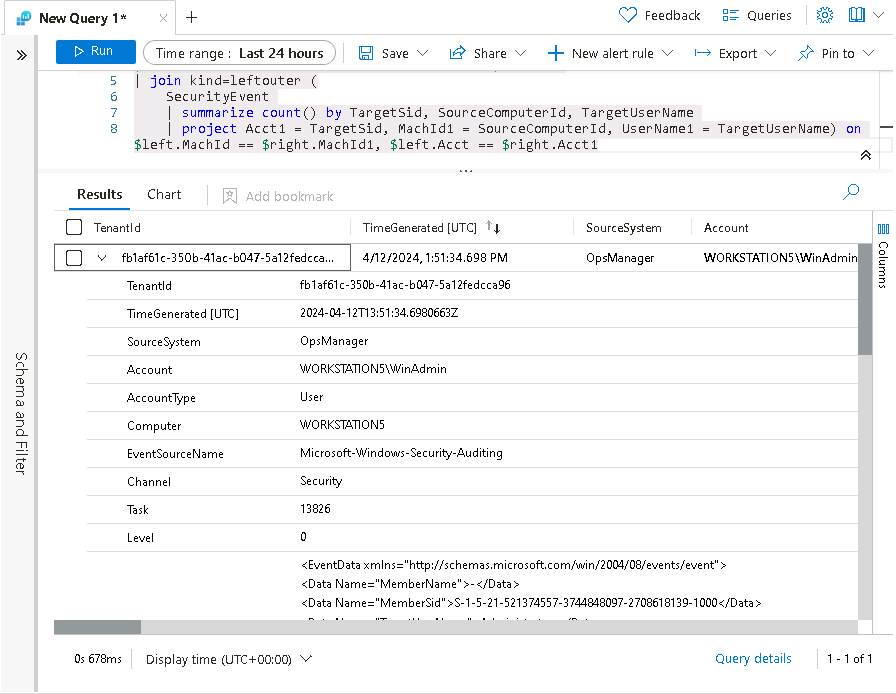
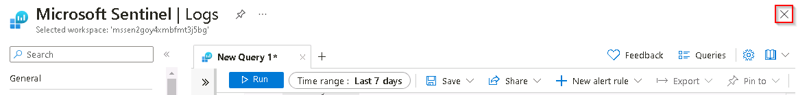
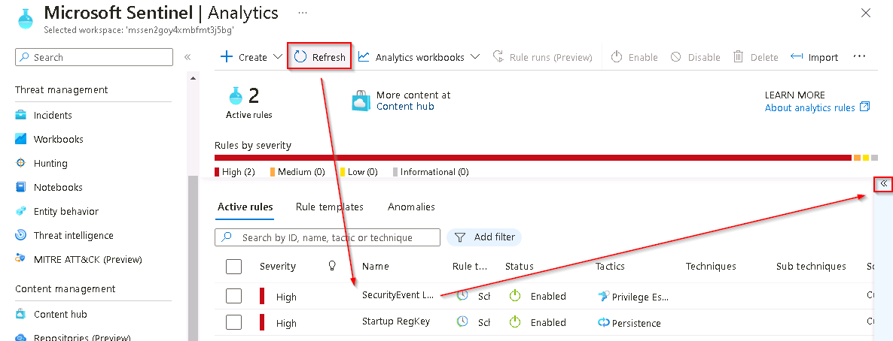

# Task 9.2: Privilege elevation attack detection

In this task, you'll create a detection for the second attack of the previous exercise, a privilege elevation attack.

The following document may help you understand detecting persistent threat attacks.

- [Detecting privilege escalation with Azure AD service principals in Microsoft Sentinel](https://learnsentinel.blog/2022/01/04/azuread-privesc-sentinel/)

---

1.  In the Microsoft Sentinel portal, select **Logs** from the **General** section.

1.  Run the following KQL Statement to identify any entry that refers to administrators:

    ```KQL
    search "administrators" 
    | summarize count() by $table
    ```

1.  The result might show events from different tables, but in our case, we want to investigate the SecurityEvent table. The EventID and event that we are looking at is "4732 - A member was added to a security-enabled local group". With this, we'llll identify adding a member to a privileged group. Run the following KQL query to confirm:

    ```KQL
    SecurityEvent 
    | where EventID == 4732
    | where TargetAccount == "Builtin\\Administrators"
    ```

1.  Expand the row to see all the columns related to the record. The username of the account added as Administrator doesn't show. The issue is that instead of storing the username, we have the Security Identifier (SID). 

    

1.  **Run** the following KQL to match the SID to the username that was added to the Administrators group:

    ```KQL
    SecurityEvent 
    | where EventID == 4732
    | where TargetAccount == "Builtin\\Administrators"
    | extend Acct = MemberSid, MachId = SourceComputerId  
    | join kind=leftouter (
        SecurityEvent 
        | summarize count() by TargetSid, SourceComputerId, TargetUserName 
        | project Acct1 = TargetSid, MachId1 = SourceComputerId, UserName1 = TargetUserName) on $left.MachId == $right.MachId1, $left.Acct == $right.Acct1
    ```

    

1.  Expand the row to show the resulting columns. In the last row we see the name of the added user under the *UserName1* column that we *project* within the KQL query. It's important to help the Security Operations Analyst by providing as much context about the alert as you can. This includes projecting Entities for use in the investigation graph. 

    

1.  Run the following query:

    ```KQL
    SecurityEvent 
    | where EventID == 4732
    | where TargetAccount == "Builtin\\Administrators"
    | extend Acct = MemberSid, MachId = SourceComputerId  
    | join kind=leftouter (
        SecurityEvent 
        | summarize count() by TargetSid, SourceComputerId, TargetUserName 
        | project Acct1 = TargetSid, MachId1 = SourceComputerId, UserName1 = TargetUserName) on $left.MachId == $right.MachId1, $left.Acct == $right.Acct1
    | extend timestamp = TimeGenerated, HostCustomEntity = Computer, AccountCustomEntity = UserName1
    ```

1.  Now that you have a good detection rule, in the Logs window, select **+ New alert rule** in the command bar and then select **Create Microsoft Sentinel alert**. 

    {: .note }
    > **Note:** You might need to select the ellipsis (...) button in the command bar.

1.  On the Analytics rule wizard, **General** tab, complete the fields using the following table and then select **Next : Set rule logic >**:

    |Setting|Value|
    |---|---|
    |Name|+++SecurityEvent Local Administrators User Add+++|
    |Description|+++User added to Local Administrators group+++|
    |Severity|**High**|
    |Tactics|+++Privilege Escalation+++|


1.  On the **Set rule logic** tab, the **Rule query** should be populated already with a KQL query. Use the following table to complete the **Query scheduling** section and then select **Next: Incident settings >**.

    |Setting|Value|
    |---|---|
    |Run Query every|5 minutes|
    |Lookup data from the last|1 Days|

    

    {: .note }
    > **Note:** We're purposely generating many incidents for the same data. This enables the lab to use these alerts.

1.  For the **Incident settings** tab, leave the default values and select **Next: Automated response >** and then select **Next: Review + create >**.

1.  On the **Review + create** tab, after the validation has passed, select the **Save** button to create the new scheduled Analytics rule.

1.  To return to the **Microsoft Sentinel** blade, close the **Microsoft Sentinel | Logs** query panel by selecting the **X** icon in the top right and then, in the close confirmation popup dialog box, select **OK**.

    

1.  On the **Microsoft Sentinel** page, select the Sentinel instance starting with **MSSen2Go\*** from the list.

1.  In the **Configuration** section of the left menu select **Analytics** to display the list of Analytics Rules.

    {: .note }
    > **Note:** If the Log Analytics rules that you just created don't appear in the list, select the **Refresh** option from the upper menu for the **Microsoft Sentinel | Analytics** blade.

1.  To display the rule details on the right, select the **SecurityEvent Local Administrators User Add** Log Analytics rule.

    {: .note }
    > **Note:** To display the right details blade, select the **<<** icon at the very right of the Active rule list.
    >
    >
