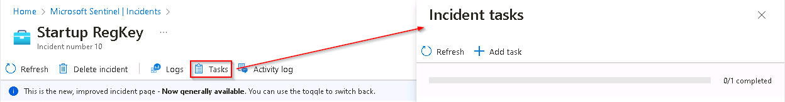

# Task 10.1: Explore an incident

In this task, you'll explore an incident using the Sentinel Incidents blade.

The following document may help you understand incident investigation.

- [Investigate incidents with Microsoft Sentinel](https://learn.microsoft.com/en-us/azure/sentinel/investigate-cases)

---

1.  If necessary, open Microsoft Edge, go to the **[Azure Portal](https://portal.azure.com)**, then sign in using these credentials:

    | | |
    |:--|:--|
    | Username | **@lab.CloudPortalCredential(User1).Username** |
    | Password | **@lab.CloudPortalCredential(User1).Password** |

    {: .warning }
    > If you encounter the **Welcome to Microsoft Azure** screen, select **Get started** and then select **Skip** for the next two screens.

1.  In the Search bar of the Azure portal, type **Microsoft Sentinel**, then select **Microsoft Sentinel**.

1.  In the list of Microsoft Sentinel Workspaces, select the workspace named **MSSen2Go\***.

    

1.  In the left menu, under **Threat management**, select **Incidents**.

1.  Review the list of incidents.

    {: .note }
    > The Analytics rules are generating alerts and incidents on the same specific log entry. Remember that this was done in the *Query scheduling* configuration to generate more alerts and incidents to be utilized in the lab.
  
1.  Select one of the **Startup RegKey** incidents.

1.  Review the incident details on the right blade that opened. Scroll down and select the **View full details** button.

    

    {: .note }
    > If the "New incident experience" pop-up appears, follow the prompts by reading the information and selecting the **Next** button.
    
    {: .warning }
    > If you encounter an "**Unknown error 0**" issue when viewing the full details, perform the following actions before continuing:
    >- Delete the **Startup RegKey** rule from the **Microsoft Sentinel - Analytics** blade 
    >- Recreate the **Startup RegKey** using the instructions from Exercise 4 Task 1.
    >
    >

1.  On the left blade of the incident, change the Status to **Active**.

    

1.  Scroll down to the *Tags* area, select **+** and enter **RegKey** and select **OK**.

    

1.  Scroll down and in the *Write a comment...* box enter **I will research this** and select the **>** icon to submit the new comment.

    

1.  Hide the left blade by selecting the **<<** icon next to the owner.

    

1.  Review the **Incident timeline** window. Select the **Incident Actions** button at top-right, and then select **Run playbook**. 

    

    {: .note }
    > The **Run playbook on incident** blade allows you to view and select the active playbooks and run them manually. Since you haven't configured any playbooks as part of this lab you won't see any listed here.

1.  Close the *Run playbook on incident* blade by selecting the **X** icon in the upper right.

    

1.  Review the **Entities** window. At least the *Host* entity that we mapped within the KQL query from the previous exercise should appear. 

    {: .note }
    > If no entities are shown, refresh the page.

    

1.  To open the **Incident tasks** blade select the **Tasks** button from the command bar.

    

1.  Select **+ Add task**, in the Title box type **Review who owns the machine** and then select **Save**.

    

1.  Close the **Incident tasks** blade by selecting the **X** icon in the upper right.

1.  Select the **Activity Log** button from the command bar and review the actions you've taken during this exercise.

    

1.  Close the **Incident activity log** blade by selecting **Close** at the lower right.

1.  From the almost hidden left blade, select the user icon named **Unassigned**. The new incident experience allows quick changes from here.

1.  Select **Assign to me** and then scroll down to select **Apply** to save the changes.

    
