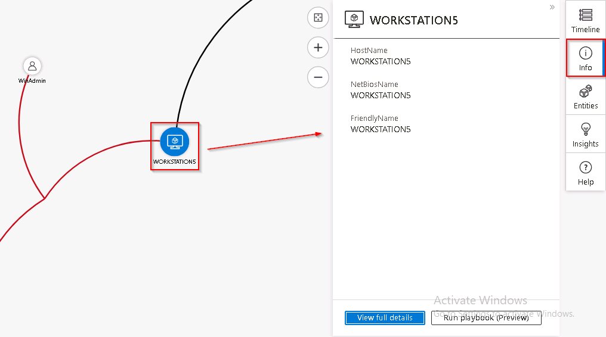
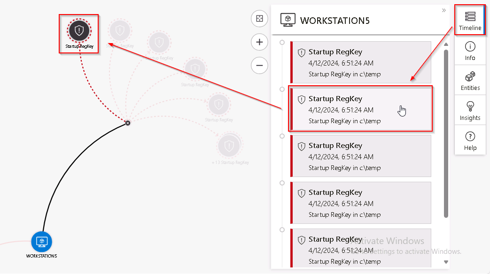
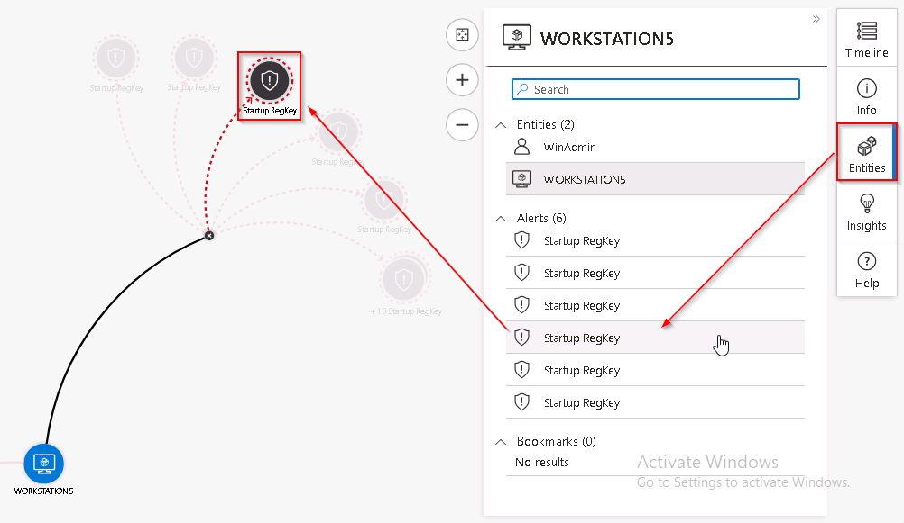
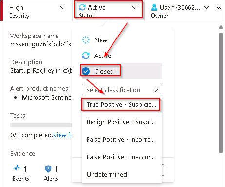

# Task 5.2: Investigate an incident

In this task, you will investigate a Sentinel incident using the Investigation blade.

---

1.  Expand the left blade by selecting the **>>** icon. and then, at the bottom, select **Investigate**.

    {: .highlight }
    > **Hint:** If the icons are too small for your screen, select **(+)** to magnify them.

1.  Hover over the **WORKSTATION5** entity icon and wait for new **exploration queries** to be shown. It looks like *Related Alerts* has more data on it. Select the name of the exploration query **Related Alerts** to bring them to the investigation graph 

1.  Hover over the **WORKSTATION5** entity icon and wait for new **exploration queries** to be shown. Hover over any node and then select **Events >** to investigate it with a KQL query.

1.  Close the query window by selecting the **X** icon at the upper right to go back to the **Investigation** page.

1.  To open a window on the right with more detailed information about the virtual machine nodes select the **WORKSTATION5** entity and review the details on the Info page.

    

1.  To see which items on the graph occurred at a point in time select the **Timeline** tab and hover over the incident.

    

1.  To review the *Entities* and *Alerts* related to **WORKSTATION5**, select the **Entities** tab and hover over the entity or alert.

    

1.  Close the investigation graph by selecting the **X** icon at the upper right of the page.

1.  Back on the incident page, in the left pane, select **Active Status** and select **Closed**. 

1.  In the *Select classification* drop-down menu review the different options. After that, select **True positive - suspicious activity** and then select **Apply**.

    

---

## Congratulations!
You've successfully completed the **TechExcel: Sentinel onboarding and migration acceleration** lab.
